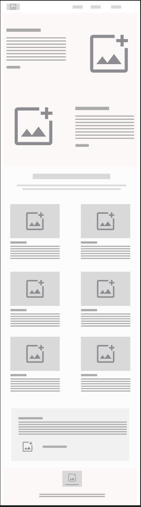

# VIAJA PT

This project was generated with [Angular CLI](https://github.com/angular/angular-cli) version 16.0.3.

## Produção de uma single page application

### Tema:

O tema foi escolhido com base na experiência de intercâmbio em Portugal de um dos integrantes do grupo (Michele Medeiros).

### Base para o Código:

O código foi desenvolvido a partir de um wirefreme de média fidelidade, desenvolvido no Figma. A logomarca foi desenvolvida no Illsutrator. Segue abaixo um print do wireframe:

### Grupo:

Michele França de Medeiros - turma 2 - al80395 - e-mail: michelefmedeiros@gmail.com

Rafael Gomes Costa - Turma 2 -
al80076 - e-mail: rafael20032003@outlook.com
